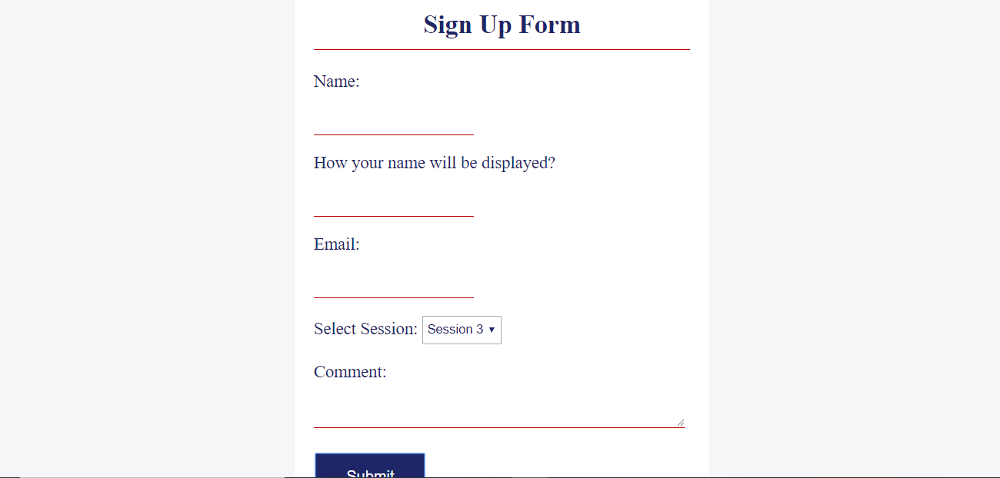

# Email Application
##
## Description
  This is a web application which is like a "Sign Up" or a "Job Application" System. The motivation behind this project was the Sign Up 
  System that my college has. For instance, when the visitor comes to the office to meet with officers, first they would fill up the
  Sign-up form which has information like name, purpose of visit, and the officer they want to visit. After they submit the form, the
  information would be emailed to the Student Worker, who would then assign them to the officer.
##
  Also, you could view this system as a system that we encounter when applying the jobs online. First of all, the user fills out the form and
  when the user submits the form, they get email notification about the job application.
##
  The front end is written in HTML/CSS and the server-side operations are written in Java (Java servlets) and JavaScript/jQuery 
  (AJAX methods). After the user fills out the form, the fields that the user filled: "name", "displayname", "email", "section"
  and "comment" are captured by the application using "HTTP POST" method. Afterwards, the email containg all those informations is
  sent out to the email address that the user entered. To send the email, I have used JavaMail API. **In this application the email couldn't
  be sent because in SendEmail class, you should provide your gmail account info: email address and password.** 
## 
  When the user launches this application, the UI looks like below,
  
  
 
##
## Structure
  The directory structure of the source code is as follows:

    project root     (root directory of project)
               |
                - src             (root directory of the source code)
               |    |           
               |    - java
               |    |     |
               |    |     - mail    
               |    |     |    |
               |    |     |    - SendEmail.java (Class which implements JavaMail APIs and is responsible to send email)
               |    |     |    |
               |    |     |    - RegistrationServlet.java (Java Servlet which implements HTTP POST method)
               |
                - web             (root directory of the web code)
                    |
                    - index.html (Main weppage where an user can fill out the form)
                    |    
                    - CSSFILE.css (CSS file which adds decoration) 
                    | 
                    - scripts
                    |       | 
                    |       - jquery-3.4.1.min.js (jQuery file)
                    |       |
                    |       - Project1.js (JavaScript file)
                    |
                    - META-INF
                    |        |
                    |        - context.xml (It adds context of the Servlet) 
                    
##
## Running this Project
   To run this project, you'll need Java (particularly Java 8), Apache Tomcat Server, and Netbeans along with JavaMail APIs.
   If you don't have these tools, you can install them as described here (https://github.com/sbanjara/RequiredTools-Installation). 
   Once you have all these required tools, you can clone this repository by running this command,
##
            git clone https://github.com/sbanjara/EmailApplication
##
   After cloning this project in your workstation, you can create a web application project in Netbeans using existing project files (i.e. the cloned files).
##
